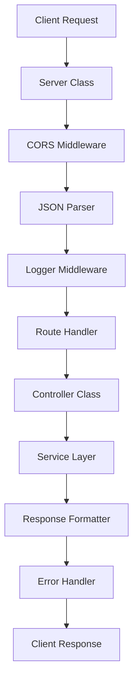

# 🔥 Enterprise API Server
## Arquitectura Moderna con TypeScript, Express & Patrones de Diseño

[](https://www.typescriptlang.org/)
[](https://expressjs.com/)
[](https://nodejs.org/)

> 🚀 **API REST robusta** implementada con arquitectura de clases, patrón Singleton y manejo avanzado de errores para aplicaciones de nivel empresarial.

---

## 📋 **Tabla de Contenidos**

- [✨ Características](#-características)
- [🏗️ Arquitectura](#️-arquitectura)
- [🚀 Instalación](#-instalación)
- [📡 Endpoints](#-endpoints)
- [🛡️ Validación](#️-validación)
- [📊 Monitoreo](#-monitoreo)
- [🔧 Configuración](#-configuración)

---

## ✨ **Características**

### 🏗️ **Arquitectura Empresarial**
- ✅ **Singleton Pattern** para gestión de instancia única del servidor
- ✅ **Clase Server** con métodos privados y públicos bien definidos
- ✅ **Separación de responsabilidades** (routes, controllers, services, middlewares)
- ✅ **Inversión de dependencias** para facilitar testing

### 🔄 **Versionado de API**
```
/api/v1/books     # Gestión de libros
/api/v1/users     # Gestión de usuarios  
/api/v1/contact   # Sistema de contacto
/health           # Health check endpoint
```

### 🛡️ **Seguridad y Validación**
- 🔒 **CORS configurado** para múltiples orígenes
- 📊 **Validación de schemas** con tipos TypeScript
- 🚨 **Manejo centralizado de errores** con códigos HTTP apropiados
- 🔍 **Logging estructurado** para auditoria

### 📈 **Performance y Monitoreo**
- ⚡ **Health checks** con timestamps
- 📊 **Métricas de rendimiento** en desarrollo
- 🔄 **Límite de payload** configurable (10MB)
- 📝 **Respuestas unificadas** con metadatos

---

## 🏗️ **Arquitectura**



### 📁 **Estructura del Proyecto**
```
src/
├── 🎯 app.ts                 # Servidor principal con clase Server
├── 📂 controllers/           # Controladores con clases y binding
│   ├── book.controller.ts    # CRUD de libros con validación
│   ├── user.controller.ts    # Gestión de usuarios
│   └── contact.controller.ts # Sistema de contacto
├── 📂 middlewares/           # Middlewares reutilizables
│   ├── logger.middleware.ts  # Logging estructurado
│   └── error.middleware.ts   # Manejo centralizado de errores
├── 📂 routes/               # Definición de rutas
├── 📂 services/             # Lógica de negocio
├── 📂 types/                # Interfaces y tipos TypeScript
└── 📂 utils/                # Utilidades y helpers
```

---

## 🚀 **Instalación**

### Prerrequisitos
```bash
Node.js >= 18.0.0
npm >= 8.0.0
TypeScript >= 5.0.0
```

### Setup Rápido
```bash
# Instalar dependencias
npm install

# Desarrollo con hot reload
npm run dev

# Build para producción
npm run build

# Ejecutar en producción
npm start
```

### Variables de Entorno
```env
NODE_ENV=development
PORT=3000
API_VERSION=v1
CORS_ORIGINS=http://localhost:3000,http://localhost:5173
```

---

## 📡 **Endpoints**

### 🩺 **Health Check**
```http
GET /health
```
**Respuesta:**
```json
{
  "status": "OK",
  "timestamp": "2025-08-07T10:30:00.000Z"
}
```

### 📚 **Books API**
```http
GET    /api/v1/books           # Obtener todos los libros
GET    /api/v1/books/:id       # Obtener libro por ID
POST   /api/v1/books           # Crear nuevo libro
PUT    /api/v1/books/:id       # Actualizar libro
DELETE /api/v1/books/:id       # Eliminar libro
```

**Ejemplo de Respuesta Unificada:**
```json
{
  "success": true,
  "data": {
    "books": [...],
    "total": 25
  },
  "message": "Encontrados 25 libros exitosamente",
  "timestamp": "2025-08-07T10:30:00.000Z",
  "status": 200
}
```

### 👥 **Users API**
```http
GET    /api/v1/users           # Obtener usuarios
POST   /api/v1/users           # Crear usuario
PUT    /api/v1/users/:id       # Actualizar usuario
DELETE /api/v1/users/:id       # Eliminar usuario
```

### 📧 **Contact API**
```http
POST   /api/v1/contact         # Enviar mensaje de contacto
GET    /api/v1/contact         # Obtener mensajes (admin)
```

---

## 🛡️ **Validación y Manejo de Errores**

### Formato de Error Estándar
```json
{
  "success": false,
  "message": "ID de libro inválido",
  "timestamp": "2025-08-07T10:30:00.000Z",
  "status": 400
}
```

### Códigos de Estado
- `200` - Operación exitosa
- `201` - Recurso creado
- `400` - Datos inválidos
- `404` - Recurso no encontrado
- `500` - Error interno del servidor

---

## 📊 **Monitoreo**

### Logging Estructurado
```typescript
// Cada request es registrado con:
{
  method: "GET",
  url: "/api/v1/books",
  timestamp: "2025-08-07T10:30:00.000Z",
  responseTime: "45ms",
  statusCode: 200
}
```

### Performance Metrics
- ⏱️ **Response time** tracking
- 📊 **Request counting** por endpoint
- 🔍 **Error rate** monitoring
- 💾 **Memory usage** en desarrollo

---

## 🔧 **Configuración Avanzada**

### CORS Personalizado
```typescript
cors({
  origin: ['http://localhost:3000', 'http://localhost:5173'],
  credentials: true,
  methods: ['GET', 'POST', 'PUT', 'DELETE'],
  allowedHeaders: ['Content-Type', 'Authorization']
})
```

### Configuración del Servidor
```typescript
class Server {
  private configureMiddlewares(): void {
    // JSON parser con límite
    this.app.use(express.json({ limit: '10mb' }));
    
    // CORS con múltiples orígenes
    this.app.use(cors(corsOptions));
    
    // Logger personalizado
    this.app.use(logRequest);
  }
}
```

---

## 🧪 **Testing**

```bash
# Tests unitarios
npm run test

# Tests de integración
npm run test:integration

# Coverage
npm run test:coverage
```

---

## 📚 **Comandos Útiles**

```bash
# Desarrollo
npm run dev              # Hot reload con ts-node-dev
npm run build           # Compilar TypeScript
npm run start           # Ejecutar build
npm run lint            # ESLint check
npm run format          # Prettier format
```

---

## 🎯 **Próximas Características**

- [ ] 🔐 **JWT Authentication**
- [ ] 🗄️ **Database integration** (MongoDB/PostgreSQL)
- [ ] 📊 **Swagger documentation**
- [ ] 🐳 **Docker containerization**
- [ ] 🔍 **Rate limiting**
- [ ] 📈 **Metrics dashboard**

---

## 🤝 **Contribuir**

1. Fork el proyecto
2. Crea tu feature branch (`git checkout -b feature/nueva-funcionalidad`)
3. Commit tus cambios (`git commit -m 'Add: nueva funcionalidad'`)
4. Push a la branch (`git push origin feature/nueva-funcionalidad`)
5. Abre un Pull Request

---

<div align="center">

**Desarrollado con ❤️ usando TypeScript y Express**

*API Enterprise lista para producción* 🚀

</div>