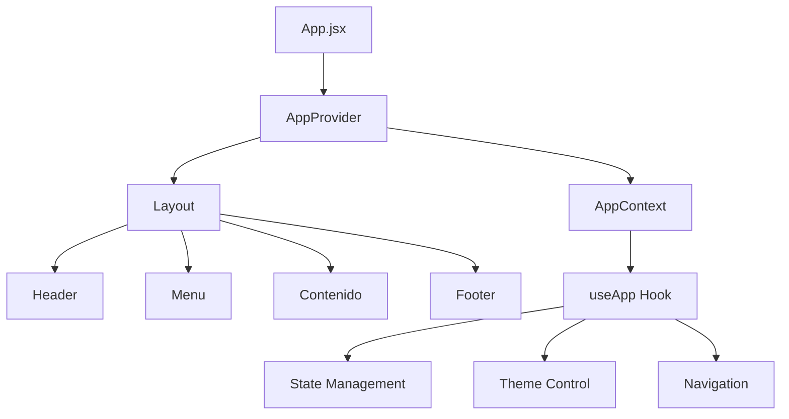

# ⚛️ Librería Yenny - React App Moderna
## Context API, Custom Hooks & Animaciones Interactivas

[](https://reactjs.org/)
[](https://vitejs.dev/)
[](https://developer.mozilla.org/en-US/docs/Web/JavaScript)

> 📚 **Aplicación web interactiva** de librería implementada con React moderno, Context API para estado global, y animaciones fluidas con Intersection Observer.

---

## 🎯 **Características Principales**

### 🧠 **Estado Global Inteligente**
- ✅ **Context API** con useReducer para manejo de estado complejo
- ✅ **Custom hooks** personalizados (`useApp`)
- ✅ **Persistencia automática** con localStorage
- ✅ **Historial de navegación** con tracking de páginas

### 🎨 **Experiencia de Usuario Avanzada**
- ✅ **Tema dinámico** (claro/oscuro) con transiciones suaves
- ✅ **Animaciones de entrada** con Intersection Observer
- ✅ **Efectos hover** interactivos en tiempo real
- ✅ **Navegación intuitiva** con iconos y descripciones

### 🚀 **Performance Optimizado**
- ✅ **Lazy loading** de componentes
- ✅ **Memoización** para prevenir re-renders innecesarios
- ✅ **Event listeners** optimizados con cleanup
- ✅ **Animaciones performantes** con requestAnimationFrame

---

## 🏗️ **Arquitectura de Componentes**



### 📁 **Estructura del Proyecto**
```
src/
├── 🎯 App.jsx                    # Componente principal con providers
├── 📂 components/               # Componentes reutilizables
│   ├── Layout.jsx              # Layout principal con composición
│   ├── Header.jsx              # Header con tema y animaciones
│   ├── Menu.jsx                # Navegación interactiva
│   ├── Contenido.jsx           # Contenido principal dinámico
│   └── Footer.jsx              # Footer responsivo
├── 📂 context/                 # Context API y estado global
│   └── AppContext.jsx          # Estado global con useReducer
├── 📂 assets/                  # Recursos estáticos
│   └── images/                 # Imágenes optimizadas
└── 🎨 App.css                   # Estilos con variables CSS
```

---

## 🚀 **Instalación y Configuración**

### Prerrequisitos
```bash
Node.js >= 18.0.0
npm >= 8.0.0
Navegador moderno con soporte ES6+
```

### Quick Start
```bash
# Instalar dependencias
npm install

# Desarrollo con hot reload
npm run dev

# Build optimizado para producción
npm run build

# Preview del build
npm run preview

# Lint del código
npm run lint
```

### URL de Desarrollo
```
🌐 http://localhost:5173
```

---

## 🎨 **Sistema de Temas**

### Configuración Automática
```javascript
// El tema se adapta automáticamente a:
- Preferencias del sistema operativo
- Configuración guardada en localStorage
- Toggle manual del usuario
```

### Temas Disponibles
```css
/* Tema Claro */
:root {
  --primary-color: #1976d2;
  --background: #ffffff;
  --text: #333333;
}

/* Tema Oscuro */
[data-theme="dark"] {
  --primary-color: #42a5f5;
  --background: #121212;
  --text: #ffffff;
}
```

---

## 🧠 **Context API y Estado Global**

### AppContext Structure
```javascript
const initialState = {
  theme: 'light',
  user: null,
  navigation: {
    currentPage: 'home',
    history: []
  },
  libreria: {
    nombre: 'LIBRERÍA YENNY',
    slogan: 'Tu biblioteca de confianza',
    info: { /* datos de contacto */ }
  }
}
```

### Acciones Disponibles
```javascript
const actions = {
  toggleTheme,           // Cambiar tema claro/oscuro
  setUser,              // Establecer usuario actual
  navigateTo,           // Navegar a página específica
  updateLibreriaInfo    // Actualizar información de la librería
}
```

### Uso del Hook Personalizado
```jsx
import { useApp } from './context/AppContext';

function MiComponente() {
  const { state, actions } = useApp();
  
  const handleThemeChange = () => {
    actions.toggleTheme();
  };
  
  return (
    <div className={`theme-${state.theme}`}>
      <h1>{state.libreria.nombre}</h1>
      <button onClick={handleThemeChange}>
        {state.theme === 'light' ? '🌙' : '☀️'}
      </button>
    </div>
  );
}
```

---

## 🎭 **Animaciones e Interacciones**

### Intersection Observer
```javascript
// Animaciones de entrada suaves
const observer = new IntersectionObserver((entries) => {
  entries.forEach(entry => {
    if (entry.isIntersecting) {
      entry.target.style.opacity = '1';
      entry.target.style.transform = 'translateY(0)';
    }
  });
});
```

### Efectos Hover Dinámicos
```javascript
// Efectos de hover con JavaScript
card.addEventListener('mouseenter', function() {
  this.style.transform = 'scale(1.05) translateY(-5px)';
});
```

### Animaciones CSS Avanzadas
```css
.menu-item {
  transition: all 0.3s cubic-bezier(0.4, 0, 0.2, 1);
  transform-origin: center;
}

.menu-item:hover {
  transform: scale(1.05) translateY(-2px);
  box-shadow: 0 10px 25px rgba(0,0,0,0.15);
}
```

---

## 📱 **Responsive Design**

### Breakpoints
```css
/* Mobile First */
.container {
  width: 100%;
  padding: 1rem;
}

/* Tablet */
@media (min-width: 768px) {
  .container {
    max-width: 768px;
    padding: 2rem;
  }
}

/* Desktop */
@media (min-width: 1024px) {
  .container {
    max-width: 1024px;
    padding: 3rem;
  }
}
```

---

## 🔧 **Configuración Avanzada**

### Vite Configuration
```javascript
// vite.config.js optimizado
export default defineConfig({
  plugins: [react()],
  server: {
    port: 5173,
    open: true
  },
  build: {
    outDir: 'dist',
    sourcemap: true,
    minify: 'terser'
  }
})
```

### Performance Optimizations
```javascript
// Lazy loading de componentes
const LazyComponent = lazy(() => import('./components/Component'));

// Memoización para prevenir re-renders
const MemoizedComponent = memo(Component);

// Cleanup de event listeners
useEffect(() => {
  const handleResize = () => { /* ... */ };
  window.addEventListener('resize', handleResize);
  
  return () => window.removeEventListener('resize', handleResize);
}, []);
```

---

## 🎯 **Funcionalidades Implementadas**

### ✅ **Completado**
- [x] Context API con useReducer
- [x] Sistema de temas dinámico
- [x] Animaciones con Intersection Observer
- [x] Navegación con historial
- [x] Persistencia en localStorage
- [x] Responsive design completo
- [x] Custom hooks reutilizables

### 🚧 **En Desarrollo**
- [ ] Sistema de búsqueda avanzada
- [ ] Carrito de compras
- [ ] Autenticación de usuarios
- [ ] API integration
- [ ] PWA capabilities

---

## 🧪 **Testing y Quality**

```bash
# Ejecutar linter
npm run lint

# Verificar tipos (si se migra a TypeScript)
npm run type-check

# Analizar bundle size
npm run analyze

# Performance audit
npm run lighthouse
```

---

## 📚 **Scripts Disponibles**

```json
{
  "dev": "vite",                    // Servidor de desarrollo
  "build": "vite build",            // Build de producción
  "preview": "vite preview",        // Preview del build
  "lint": "eslint .",              // Verificación de código
  "format": "prettier --write ."   // Formateo automático
}
```

---

## 🌟 **Mejores Prácticas Implementadas**

- 🎯 **Single Responsibility** - Cada componente tiene una responsabilidad específica
- 🔄 **DRY Principle** - Reutilización de lógica con custom hooks
- 📦 **Component Composition** - Composición sobre herencia
- 🎨 **CSS-in-JS Alternative** - Variables CSS para theming
- ⚡ **Performance First** - Optimizaciones desde el diseño

---

<div align="center">

**🚀 Librería Yenny - Donde los libros cobran vida 📚**

*Desarrollado con React moderno y mejores prácticas*

</div>
